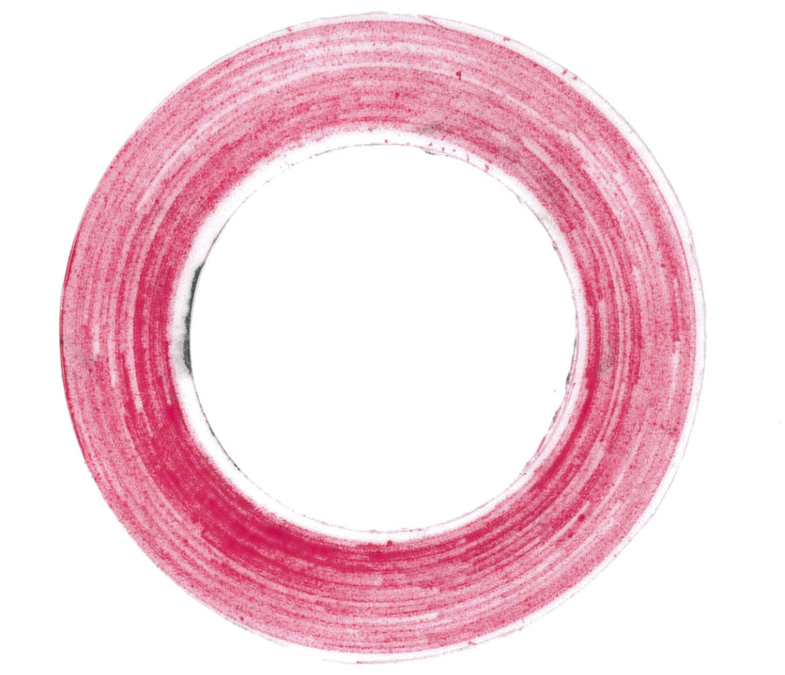
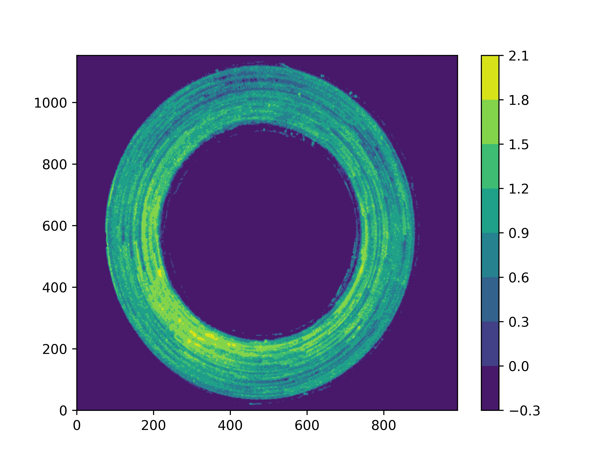

# Prescale
Pressure estimation from images of Prescale foils.

Results can be exported as images or as interactive plotly if offline mode.

Basic usage:  
python3 readfoil.py path/to/image

Example:  
python3 readfoil.py test_files/circle.jpg

For help use:  
python3 readfoil.py --help

Compatible with python 3.x  
Please make sure that the following packages are installed:
 - argparse
 - os
 - cv2
 - numpy
 - scipy
 - csv
 - plotly (only necessary for interactive versions of plots)
